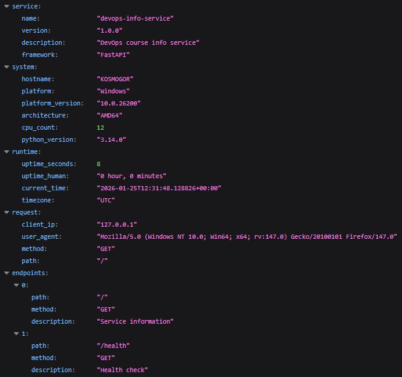
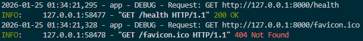

# Lab 01

## Chosing Web Framework

As web framework I chose FastAPI for some reasons:

- It's very fast
- It's lightweight
- Auto-documentation can speed up process

Django was more weightfull and Flask was slower than FastAPI

## Best Practices Applied

- Clear function names like `get_time_info()` - increases code readability
- Comments only where needed - increases code readability
- Following PEP8 - increases code readability

## API Documentation

API documentation can be found on `http://[HOST]:[PORT]/docs` (defaults to <http://127.0.0.1:8000/docs>)

## Testing Evidence

`/` endpoint:

`/health` endpoint:

some terminal output:

## Challenges & Solutions

Initially I had a problem with selecting framework. But I solved it after reading some info about them and compairing them.

## GitHub Community

Starring repositories in open source can help projects become more popular or help you to return to them later for reference.

Following developers can help to find more collaborations and then have professional growth
