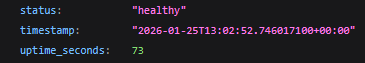

# Lab 01 Bonus Task

## Chosing Web Framework

As web framework I chose Actix Web for some reasons:

- It's very fast
- It's lightweight
- It's async and uses tokio udner it

## Best Practices Applied

- Clear function names like `app_root()` or `app_health()` - increases code readability
- Comments only where needed - increases code readability
- Following clear code structure and syntax - increases code readability

## API Documentation

- `/` endpoint - retuns information about service, server system, runtime, user request and endpoints
- `/health` endpoint - checking server health

## Testing Evidence

`/` endpoint:

`/health` endpoint:

some terminal output:

## Challenges & Solutions

Initially I had a problem with selecting framework. But I solved it after reading some info about them and compairing them.
