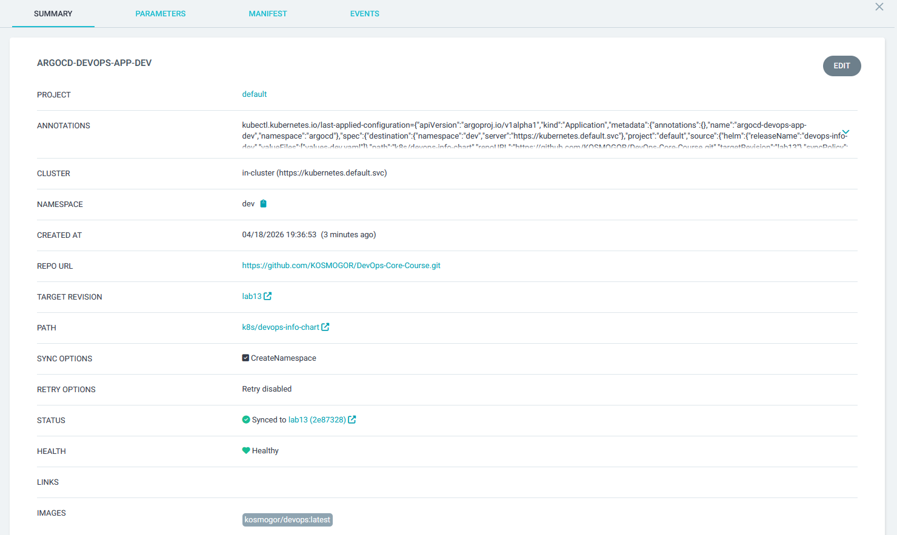

# Lab13

## ArgoCD Setup

ArgoCD is installed in `argocd` namespace:

```bash
$ helm list -n argocd
NAME    NAMESPACE       REVISION        UPDATED                                 STATUS          CHART           APP VERSION
argocd  argocd          1               2026-04-18 14:31:06.2871385 +0300 MSK   deployed        argo-cd-9.5.2   v3.3.7
```

UI is accessed using port forwarding:

```bash
$ kubectl port-forward service/argocd-server -n argocd 8080:443
Forwarding from 127.0.0.1:8080 -> 8080
Forwarding from [::1]:8080 -> 8080
```

And then accessing `localhost:8080`.

ArgoCD CLI is also installed:

```bash
$ ./argocd-windows-amd64 version
argocd: v3.3.7+035e855
  BuildDate: 2026-04-16T15:58:07Z
  GitCommit: 035e8556c451196e203078160a5c01f43afdb92f
  GitTreeState: clean
  GoVersion: go1.25.5
  Compiler: gc
  Platform: windows/amd64
```

## 2. Application Configuration

ArgoCD manifests are located in `k8s/argocd` folder.

Source configuration includes repo link (<https://github.com/KOSMOGOR/DevOps-Core-Course.git>), target branch (lab13), path to chart (`k8s/devops-info-chart`) and helm value file (`values.yaml`).

## 3. Multi-Enviroment

Dev and prod manifests use different values files (`-dev` and `-prod` respectively). Dev uses selfheal with prune, while prod uses only manual heal.

Also, they use different namespaces (`dev` and `prod` respectively).

## 4. Self-Healing Evidence

Manual scaling:

```bash
$ kubectl get deploy -n dev
NAME              READY   UP-TO-DATE   AVAILABLE   AGE
devops-info-dev   1/1     1            1           3m4s

$ kubectl scale deployment devops-info-dev -n dev --replicas=3
deployment.apps/devops-info-dev scaled

$ kubectl get deploy -n dev
NAME              READY   UP-TO-DATE   AVAILABLE   AGE
devops-info-dev   1/1     1            1           4m4s
```

Pod deletion test:

```bash
$ kubectl get pods -n dev
NAME                               READY   STATUS    RESTARTS   AGE
devops-info-dev-84bbb779d9-25n9d   1/1     Running   0          5m2s

$ kubectl delete pod devops-info-dev-84bbb779d9-25n9d -n dev
pod "devops-info-dev-84bbb779d9-25n9d" deleted from dev namespace

$ kubectl get pods -n dev
NAME                               READY   STATUS    RESTARTS   AGE
devops-info-dev-84bbb779d9-whpkv   1/1     Running   0          2m15s
```

Configuration drift test:

```bash
$ kubectl get deployment devops-info-dev -n dev -o jsonpath='{.spec.template.spec.containers[0].image}'
kosmogor/devops:latest

$ kubectl patch deployment devops-info-dev -n dev --type='json' -p='[{"op":"replace","path":"/spec/template/spec/containers/0/image","value":"test"}]'
deployment.apps/devops-info-dev patched

$ kubectl get deployment devops-info-dev -n dev -o jsonpath='{.spec.template.spec.containers[0].image}'
kosmogor/devops:latest
```

In all cases ArgoCD sees differences from desired version and (with `selfHeal: true`) restores it to desired version.

## 5. Screenshots

ArgoCD apps are deployed and working:


Dev app details:


