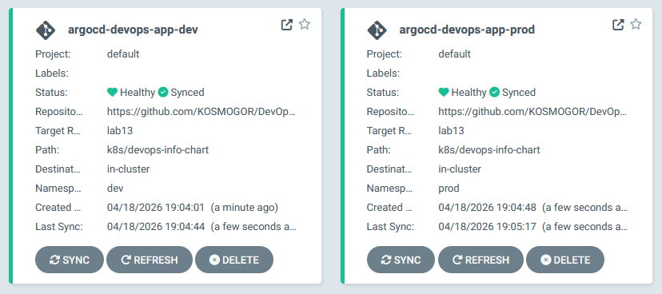

# Lab13

## ArgoCD Setup

ArgoCD is installed in `argocd` namespace:

```bash
$ helm list -n argocd
NAME    NAMESPACE       REVISION        UPDATED                                 STATUS          CHART           APP VERSION
argocd  argocd          1               2026-04-18 14:31:06.2871385 +0300 MSK   deployed        argo-cd-9.5.2   v3.3.7
```

UI is accessed using port forwarding:

```bash
$ kubectl port-forward service/argocd-server -n argocd 8080:443
Forwarding from 127.0.0.1:8080 -> 8080
Forwarding from [::1]:8080 -> 8080
```

And then accessing `localhost:8080`.

ArgoCD CLI is also installed:

```bash
$ ./argocd-windows-amd64 version
argocd: v3.3.7+035e855
  BuildDate: 2026-04-16T15:58:07Z
  GitCommit: 035e8556c451196e203078160a5c01f43afdb92f
  GitTreeState: clean
  GoVersion: go1.25.5
  Compiler: gc
  Platform: windows/amd64
```

## 2. Application Configuration

ArgoCD manifests are located in `k8s/argocd` folder.

Source configuration includes repo link (<https://github.com/KOSMOGOR/DevOps-Core-Course.git>), target branch (lab13), path to chart (`k8s/devops-info-chart`) and helm value file (`values.yaml`).

## 3. Multi-Enviroment

Dev and prod manifests use different values files (`-dev` and `-prod` respectively). Dev uses selfheal with prune, while prod uses only manual heal.

Also, they use different namespaces (`dev` and `prod` respectively).

## 4. Self-Healing Evidence


## 5. Screenshots

ArgoCD apps are deployed and working:


