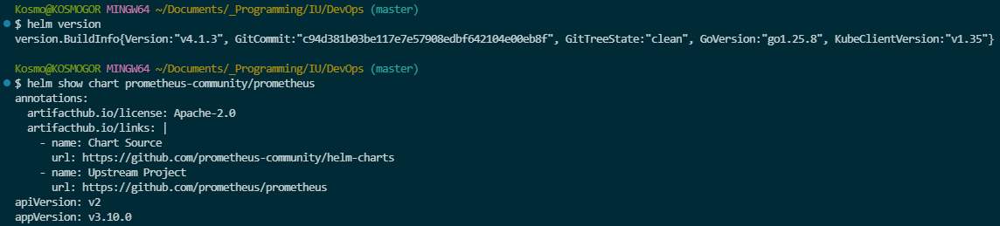

# Lab 10

## 1. Chart Overview

Chart includes:

- its own config (`Chart.yaml`)
- values files (`values.yaml`, `values-dev.yaml`, `values-prod.yaml`) for different situations (like development and production)
- template files (`templates/deployment.yml` for creating replicas, `templates/service.yml` for creating `NodePort`)
- hooks (all files in `templates/hooks/`)

## 2. Configuration Guide

Most important values probably will be `image` related ones (like `repository` and `tag`), `service` related ones and `resources`.

Different enviroments configuration contains in `values-dev.yaml` and `values-prod.yaml`.

## 3. Hook Implementation

2 hooks was implemented:

- pre-install-validation - validates configuration, has weight of -5
- post-install-smoke-test - tests app after installation, has weight of 5

Both hooks has deletion police `hook-succeeded` - hook is deleted after completion.

## 4. Installation Evidence

Helm installation evidance:



`helm list` output:

```bash
NAME           NAMESPACE       REVISION        UPDATED                                STATUS          CHART                  APP VERSION
myapp-dev      default         1               2026-03-28 13:29:24.126436 +0000 UTC   deployed        devops-info-0.1.0      1.0.0
hooks-demo     default         1               2026-03-28 12:30:35.787062 +0000 UTC   deployed        devops-info-0.1.0      1.0.0
```

`kubectl get all`

```bash
NAME                                             READY   STATUS    RESTARTS   AGE
pod/myapp-dev-devops-info-6b4f9c5d8b-4k5jv       1/1     Running   0          13m
pod/myapp-dev-devops-info-6b4f9c5d8b-7x8m2       1/1     Running   0          13m
pod/myapp-dev-devops-info-6b4f9c5d8b-9h3t1       1/1     Running   0          13m

NAME                                TYPE        CLUSTER-IP      PORT(S)        AGE
service/myapp-dev-devops-info       NodePort    10.98.172.45    80:30000/TCP   13m

NAME                                        READY   UP-TO-DATE   AVAILABLE   AGE
deployment.apps/myapp-dev-devops-info       3/3     3            3           13m

NAME                                                   DESIRED   CURRENT   READY   AGE
replicaset.apps/myapp-dev-devops-info-6b4f9c5d8b       3         3         3       13m
```

`kubectl get jobs` output:

```bash
NAME                                   COMPLETIONS   DURATION   AGE
hooks-demo-devops-info-pre-install     1/1           12s        14m
hooks-demo-devops-info-post-install    1/1           15s        14m
```

## 5. Operations

Installation commands:

```bash
# Basic installation
helm install myapp k8s/devops-info-chart

# Development environment
helm install myapp-dev k8s/devops-info-chart -f values-dev.yaml

# Production environment
helm install myapp-prod k8s/devops-info-chart -f values-prod.yaml
```

Upgrade Release:

```bash
# Upgrade with new values
helm upgrade myapp-prod k8s/devops-info-chart -f values-prod.yaml

# Upgrade and wait for rollout
helm upgrade myapp-prod k8s/devops-info-chart --wait --timeout 5m
```

Rollback:

```bash
# Check history
helm history prod

# Rollback to previous revision
helm rollback prod 1

# Rollback with wait
helm rollback prod 1 --wait
```

Uninstall:

```bash
# Remove release
helm uninstall prod

# Remove with confirmation
helm uninstall prod --keep-history
```

## 6. Testing & Validation

`helm lint devops-info-chart` output:

```bash
==> Linting devops-info-chart
[INFO] Chart.yaml: icon is recommended

1 chart(s) linted, 0 chart(s) failed
```

`helm template devops-info-chart` output:

```yaml
---
# Source: devops-info/templates/service.yml
apiVersion: v1
kind: Service
metadata:
  name: release-name-devops-info
  labels:
    helm.sh/chart: devops-info-0.1.0
    app.kubernetes.io/name: devops-info
    app.kubernetes.io/instance: release-name
    app.kubernetes.io/version: "1.0.0"
    app.kubernetes.io/managed-by: Helm
spec:
  type: NodePort
  selector:
    app.kubernetes.io/name: devops-info
    app.kubernetes.io/instance: release-name
  ports:
  - protocol: TCP
    port: 80
    targetPort: 8000
    nodePort: 30000
---
# Source: devops-info/templates/deployment.yml
apiVersion: apps/v1
kind: Deployment
metadata:
  name: release-name-devops-info
  labels:
    helm.sh/chart: devops-info-0.1.0
    app.kubernetes.io/name: devops-info
    app.kubernetes.io/instance: release-name
    app.kubernetes.io/version: "1.0.0"
    app.kubernetes.io/managed-by: Helm
spec:
  replicas: 3
  selector:
    matchLabels:
      app.kubernetes.io/name: devops-info
      app.kubernetes.io/instance: release-name
  strategy:
    type: RollingUpdate
    rollingUpdate:
      maxSurge: 1
      maxUnavailable: 0
  template:
    metadata:
      labels:
        app.kubernetes.io/name: devops-info
        app.kubernetes.io/instance: release-name
    spec:
      serviceAccountName: release-name-devops-info

      containers:
      - name: devops-info

        securityContext:
          allowPrivilegeEscalation: false
          capabilities:
            drop:
            - ALL
          runAsNonRoot: true
          runAsUser: 1000
        image: "kosmogor/devops:latest"
        imagePullPolicy: IfNotPresent
        ports:
        - name: http
          containerPort: 8000
          protocol: TCP
        env:
        - name: APP_NAME
          value: "devops-info-helm"
        - name: DEBUG
          value: "false"

        resources:
          requests:
            memory: 64Mi
            cpu: 50m
          limits:
            memory: 128Mi
            cpu: 100m

        livenessProbe:
          httpGet:
            path: /health
            port: 5050
          initialDelaySeconds: 15
          periodSeconds: 10
          timeoutSeconds: 3
          failureThreshold: 3

        readinessProbe:
          httpGet:
            path: /health
            port: 5050
          initialDelaySeconds: 5
          periodSeconds: 5
          timeoutSeconds: 2
          successThreshold: 1
---
# Source: devops-info/templates/hooks/post-install-test.yaml
apiVersion: batch/v1
kind: Job
metadata:
  name: release-name-devops-info-post-install
  annotations:
    "helm.sh/hook": post-install
    "helm.sh/hook-weight": "5"
    "helm.sh/hook-delete-policy": hook-succeeded
spec:
  template:
    metadata:
      name: release-name-devops-info-post-install
    spec:
      restartPolicy: Never
      containers:
      - name: smoke-test
        image: curlimages/curl:latest
        command:
          - /bin/sh
          - -c
          - |
            echo "Running smoke tests..."

            SERVICE_NAME="release-name-devops-info"
            NAMESPACE="default"

            echo "Waiting for service $SERVICE_NAME to be ready..."

            for i in $(seq 1 30); do
              if curl -s -o /dev/null -w "%{http_code}" http://$SERVICE_NAME:80/health | grep -q "200"; then
                echo "Service is ready!"
                break
              fi
              echo "Attempt $i: Service not ready yet..."
              sleep 2
            done

            echo -n "Test 1: Health endpoint... "
            HEALTH_RESPONSE=$(curl -s -o /dev/null -w "%{http_code}" http://$SERVICE_NAME:80/health)
            if [ "$HEALTH_RESPONSE" = "200" ]; then
              echo "OK (HTTP $HEALTH_RESPONSE)"
            else
              echo "FAILED (HTTP $HEALTH_RESPONSE)"
              echo "Continuing despite health check failure for demonstration"
            fi

            echo -n "Test 2: Main endpoint... "
            MAIN_RESPONSE=$(curl -s -o /dev/null -w "%{http_code}" http://$SERVICE_NAME:80/)
            if [ "$MAIN_RESPONSE" = "200" ]; then
              echo "OK (HTTP $MAIN_RESPONSE)"
            else
              echo "Main endpoint returned $MAIN_RESPONSE"
            fi

            echo "Smoke tests completed!"
            exit 0
---
# Source: devops-info/templates/hooks/pre-intall-job.yaml
apiVersion: batch/v1
kind: Job
metadata:
  name: release-name-devops-info-pre-install
  annotations:
    "helm.sh/hook": pre-install
    "helm.sh/hook-weight": "-5"
    "helm.sh/hook-delete-policy": hook-succeeded
spec:
  template:
    metadata:
      name: release-name-devops-info-pre-install
    spec:
      restartPolicy: Never
      containers:
      - name: pre-install-validation
        image: alpine:latest
        command:
          - /bin/sh
          - -c
          - |
            echo "Pre-install validation started..."

            echo "Checking image: kosmogor/devops:latest"
            if [ -z "latest" ]; then
              echo "ERROR: Image tag is not set!"
              exit 1
            fi

            if [ 128Mi =~ "Mi" ] && [ 64Mi =~ "Mi" ]; then
              echo "Memory limits look good"
            else
              echo "Warning: Memory limits not in Mi format"
            fi
            echo "ENV APP_NAME is set"
            echo "ENV DEBUG is set"

            echo "Service will expose port 80 -> 8000"

            echo "Pre-install validation completed successfully"
            exit 0
```

`curl http://localhost/health` output:

```bash
{
  "status": "healthy",
  "timestamp": "2026-03-28T14:09:36.643834Z",
  "uptime_seconds": 1182
}
```

## 7. Library Charts

Implemented `common-lib` contains `.tpl` find with `defines` in `common-lib/template/_heplers` folder.

`common-lin` has implementations for `fullname`, `resources` and other useful things.

App templates use it for reources, selectors, probes and security. It reduces duplicated code and increases readability.
