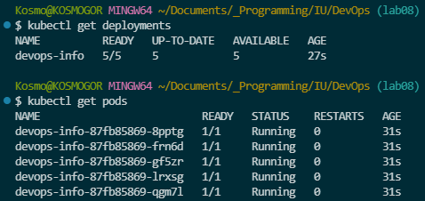
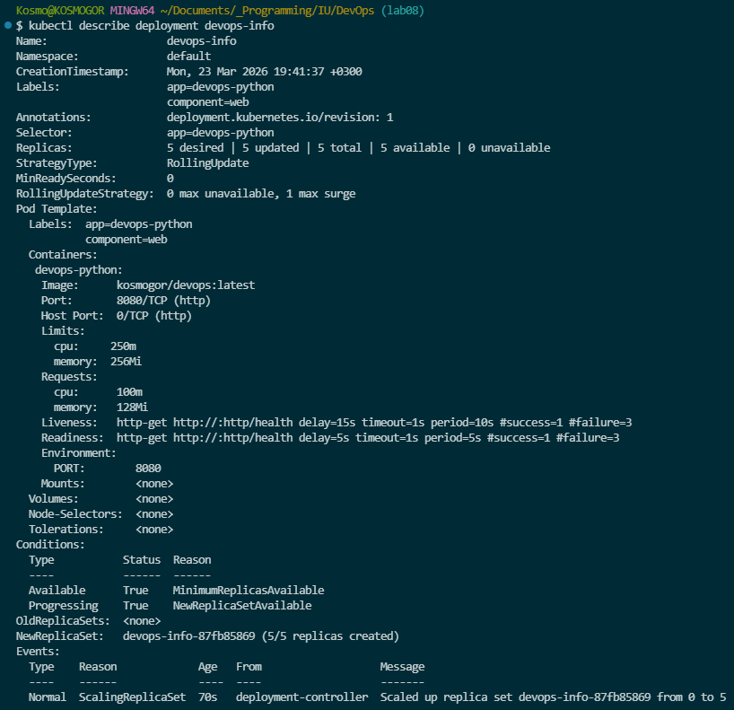
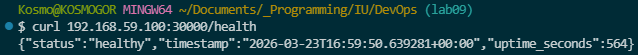

# Lab09

## 1. Architecture Overview

Application has 5 pods in `Depoyment` resource, which manages apps, and 1 service of type `NodePort`, whick manages access.

Each container 100m CPU and 128Mi memory. These resources should be enough for this small app.

## 2. Manifest Files

- `deployment.yml` - contains information about apps deployment, including enviroment values, count, and resources. Replicas count was scaled to 5, contains liveness and readiness probes
- `service.yml` - contains information about `NodePort` service for exposing `Deployment` apps

## 3. Deployment Evidence

Deployment info:



Deployment describe:



Curl:



## 4. Operations Performed

Apps was deployed by using:

```bash
kubectl apply -f k8s/deployment.yml
kubectl apply -f k8s/service.yml
```

Service was accessed using:

```bash
curl 10.244.0.16
```

## 5. Production Considerations

As health checks was used `/health` path (for `livenessProbe` and `readinessProbe`)

Max resources was limited by 250m CPU and 256Mi memory.

Monitoring and observability in production can include Promtail, Loki, Grafana and Prometheus.

## 6. Challenges & Solutions

I had problems with writing `.yml` config files, but I solved it by looking in documentation.
