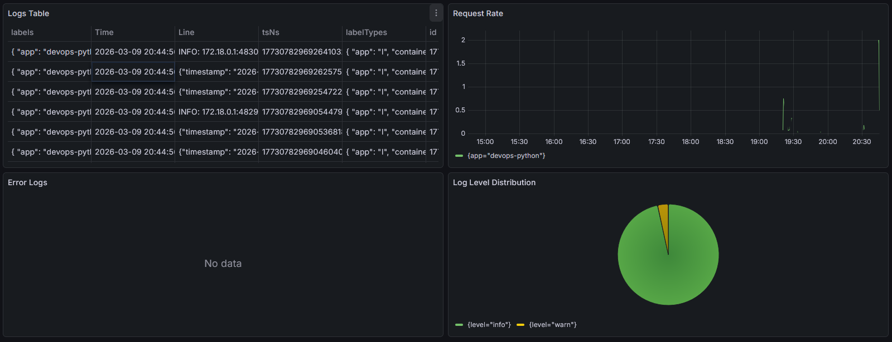

# Lab 07

## 1. Architecture

Application writes logs -> Docker captures it -> Promtail captures it -> Promtail pushes it to Loki -> Grafana display logs found in Loki.

## 2. Setup Guide

```bash
# Go to monitoring directory
cd monitoring

# Copy .env from the example template and set your password
cp example.env .env

# Start docker compose
docker compose up -d

# Verify all services are running
docker compose ps
```

## 3. Configuration

### Loki

Loki configuration uses last version of schema, TSDB indexing (it's faster than others), logs stored for 7 days.

### Promtail

Promtail configuration uses Docker socket for discovering containers, filters them for getting logs, and refreshes every 5 seconds (balance between workload and response time).

## 4. Application Logging

I implemented logging by using custom JSON formatter, that is used in logging handler.

## 5. Dashboard

Dashboard has 4 panels.



- Logs Table - shows recent logs from all apps
- Request Rate - shows logs per second by app
- Error Logs - shows only ERROR level logs
- Log Level Distribution - count logs by level (info, warn, etc.)

## 6. Production Config

- All monitoring apps has their resources limited to 1 cpu and 1G memory
- Grafana anonymous login is disabled
- password is stored in `.env` file
- `.env` file is in `.gitignore`
- Loki and Promtail have healthchecks

## 7. Testing

```bash
# All services running and healthy
docker compose ps

# Loki ready
curl http://localhost:3100/ready

# Loki labels populated
curl http://localhost:3100/loki/api/v1/labels

# Grafana healthy
curl http://localhost:3000/api/health

# App is running
curl http://localhost:8000/health
```

## 8. Challenges

I had troubles with creating `docker-compose.yml` file, but I solved it by checking documentation.
