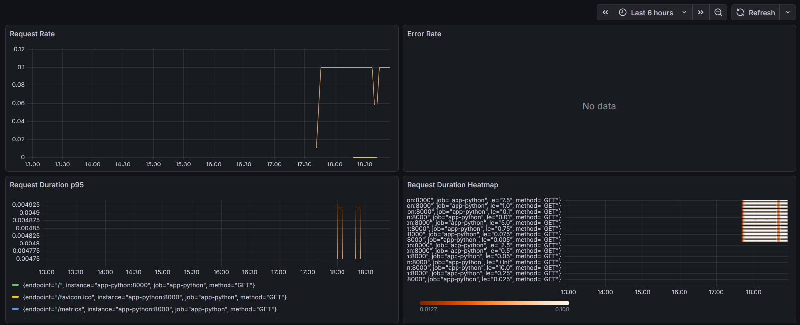
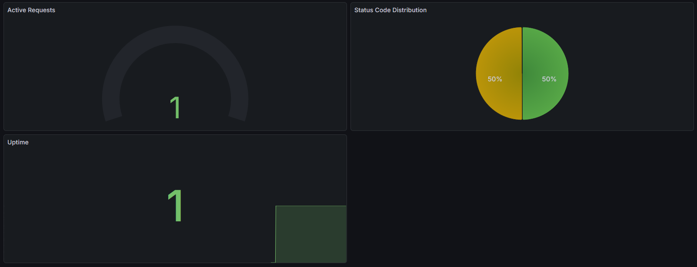
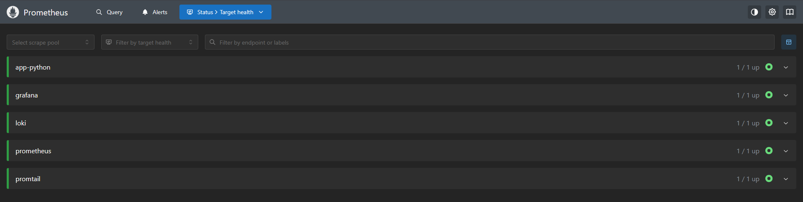
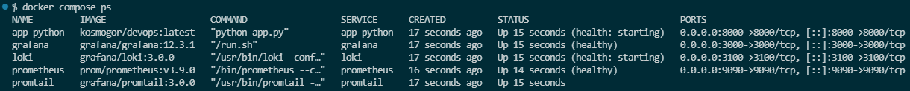
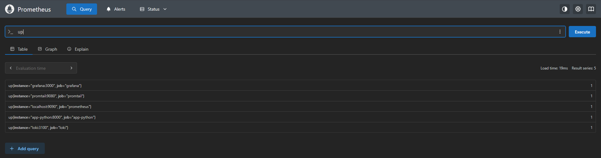

# Lab 08

## 1. Architecture

Application writes metrics -> Prometheus captures it -> Grafana display logs found in Prometheus.

## 2. Application Instrumentation

As metrics I used:

- http_requests_total - shows total number of requests to see load over time
- http_request_duration_seconds - shows duration of requests to see load at any given time
- http_requests_in_progress - shows number of requests processing now to see load right now
- system_info_duration - shows duration of processing system info to see load on `/` path

## 3. Prometheus Configuration

- Scrape targets - prometheus, app-python, loki, grafana, promtail
- Intervals - 15 (10 for app-python) seconds for scrape and evaluation
- Retention - 15 days and 10GB

## 4. Dashboard Walkthrough




- Request Rate - shows requests/sec per endpoint
- Error Rate - shows 5xx errors/sec
- Request Duration p95 - shows 95th percentile latency
- Request Duration Heatmap - visualizes latency distribution
- Active Requests - shows concurrent requests
- Status Code Distribution - shows 2xx vs 4xx vs 5xx
- Uptime - shows if service is up (1) or down (0)

## 5. PromQL Examples

- `sum(rate(http_requests_total[5m])) by (endpoint)` - shows requests/sec per endpoint
- `sum(rate(http_requests_total{status=~"5.."}[5m]))` - shows 5xx errors/sec
- `histogram_quantile(0.95, rate(http_request_duration_seconds_bucket[5m]))` - shows 95th percentile latency
- `rate(http_request_duration_seconds_bucket[5m])` - visualizes latency distribution
- `http_requests_in_progress` - shows concurrent requests
- `sum by (status) (rate(http_requests_total[5m]))` - shows 2xx vs 4xx vs 5xx
- `up{job="app-python"}` - shows if service is up (1) or down (0)

## 6. Production Setup

```bash
# All services running and healthy
docker compose ps

# Prometheus ready
curl http://localhost:9090/-/healthy

# Loki ready
curl http://localhost:3100/ready

# Loki labels populated
curl http://localhost:3100/loki/api/v1/labels

# Grafana healthy
curl http://localhost:3000/api/health

# App is running
curl http://localhost:8000/health
```

Retention policies are stored in `/monitoring/prometheus/prometheus` and `/monitoring/docker-compose.yml`.

## 7. Testing Results





## 8. Challenges

I had troubles with creating `docker-compose.yml` file `prometheus.yml` file, but I solved it by checking documentation.
